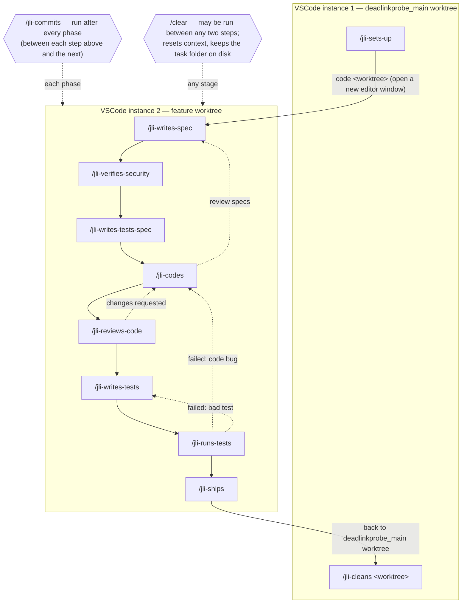

# Agent-to-Command Migration

This document describes how the orchestrator-driven multi-agent pipeline (the `.agents-brain/`
agents) was migrated into a **manually-chained set of `jli-` slash commands**. The new
commands are the supported way to develop a feature; the old orchestrator flow (driven from
the main conversation via `.agents-brain/agent-0-orchestrator.md`) is deprecated.

## Why

The pipeline was driven by `agent-0-orchestrator`, which spawned every specialist agent and
threaded state through one long-running context. That context overflowed easily and left the
human no natural place to intervene between phases. The manual chain fixes both: each command
is a single, stateless step the human runs by hand, with a `/clear` allowed between any two
steps to keep context small.

## Worktree layout and run location

The repo is one bare repo with sibling worktrees under a shared parent:

```
E:/Git/GitHub/deadlinkprobe.git                 <- bare repo
E:/Git/GitHub/deadlinkprobe_main                <- main worktree (chain home)
E:/Git/GitHub/deadlinkprobe_<type>-<slug>       <- a feature worktree
```

`/jli-sets-up` and `/jli-cleans` run from the **`deadlinkprobe_main` worktree**. Every other
command runs from inside the **feature worktree** — you open it in its own editor window
(`code <worktree>`) after setup, and all later commands run in that window. Feature branches
and worktrees are cut from `origin/main`; PRs target `main`.

## How state flows

All state lives in the task folder under the feature worktree:
`docs/tasks/issue-<id>-<slug>/`. Each command reads the artifacts written by earlier commands
and writes its own. Because the phase/commit/ship commands run *inside* the feature worktree,
the task folder is a simple relative path — you pass it as a `@`-mention
(`@docs/tasks/issue-<id>-<slug>`), never an absolute path. The argument is required on every
command, so each one rebuilds what it needs from disk after a `/clear`.

The **specification phase is the input exception**: `/jli-writes-spec` reads the `README.md`
request created by `/jli-sets-up` rather than a prior pipeline artifact.

## Pipeline scripts

The git-heavy steps shell out to small scripts in `scripts/pipeline/` so the commands stay
declarative and portable (no hardcoded paths — each script resolves the bare repo from
`git rev-parse --git-common-dir`):

| Script | Used by | Does |
|---|---|---|
| `fetch-origin.sh` | `jli-sets-up` | `git fetch origin --prune` |
| `worktree-create.sh <type> <slug>` | `jli-sets-up` | create `<repo>_<type>-<slug>` worktree on `<type>/<slug>` off `origin/main`; install `requirements-dev.txt`; print `Worktree: <path>` |
| `pr-create.sh <worktree> <title> <body-file>` | `jli-ships` | push branch, open PR against `main`; print `PR: <url>` |
| `pr-complete.sh <pr>` | `jli-ships` | rebase-merge and delete remote branch; skip if already merged |
| `worktree-cleanup.sh <worktree>` | `jli-cleans` | remove worktree, prune, force-delete local branch |
| `refresh-main.sh` | `jli-cleans` | fast-forward `main` to `origin/main` |

## Command ↔ agent mapping

| Command | Runs from | Replaces (agent) |
|---|---|---|
| `/jli-sets-up <issue-num + title>` | `deadlinkprobe_main` | `agent-4-git` (fetch + branch/worktree) |
| `/jli-writes-spec @<task-folder>` | feature worktree | `agent-1-specs` |
| `/jli-verifies-security @<task-folder>` | feature worktree | *new phase — no prior agent* |
| `/jli-writes-tests-spec @<task-folder>` | feature worktree | `agent-3-tester` (pass 1: test cases) |
| `/jli-codes @<task-folder>` | feature worktree | `agent-2-coder` |
| `/jli-reviews-code @<task-folder>` | feature worktree | *new phase — was `agent-2-coder` self-review* |
| `/jli-writes-tests @<task-folder>` | feature worktree | `agent-3-tester` (pass 2: `test_*.py`) |
| `/jli-runs-tests @<task-folder>` | feature worktree | `agent-3-tester` (run) |
| `/jli-commits @<task-folder>` | feature worktree | `agent-4-git` (commit between phases) |
| `/jli-ships @<task-folder>` | feature worktree | `agent-4-git` (push, PR, merge) |
| `/jli-cleans <worktree>` | `deadlinkprobe_main` | `agent-4-git` (worktree cleanup + refresh main) |

`agent-0-orchestrator` is **dissolved** into the "Next" hint at the end of each command — no
command replaces it. The migration also **adds two phases** the old five-agent pipeline folded
into other agents: a standalone security pass (`/jli-verifies-security`) and a standalone code
review (`/jli-reviews-code`).

`agent-4-git`'s responsibilities were split into four commands — `setup` (bootstrap),
`commit` (its own step between phases), `ship` (push + PR + merge), and `cleanup` (worktree
removal + refresh main). `cleanup` is separate because it cannot run from inside the worktree
it removes.

## The chain

The full workflow, including the two-editor split and the loop-backs:



Setup (`/jli-sets-up`) and cleanup (`/jli-cleans`) run in the **`deadlinkprobe_main`
editor**; every phase command runs in a **separate editor window** opened on the feature
worktree. `/clear` is available at any stage — each command rebuilds what it needs from the
task folder, so clearing context between steps is safe. The same chain in text:

```
[deadlinkprobe_main worktree]
/jli-sets-up
  > code <worktree>            (open the feature worktree; everything below runs there)

[feature worktree]
  > /jli-writes-spec        > /jli-commits
  > /jli-verifies-security  > /jli-commits
  > /jli-writes-tests-spec  > /jli-commits      (writes test-cases.md)
  > /jli-codes              > /jli-commits
  > /jli-reviews-code       > /jli-commits
  > /jli-writes-tests       > /jli-commits      (writes tests/test_*.py)
  > /jli-runs-tests         > /jli-commits
  > /jli-ships                  (push + PR + merge)

[back in deadlinkprobe_main worktree]
  > /jli-cleans <worktree>
```

Loop-backs (each command's hint states the branch it took):
- `/jli-reviews-code` > `status: changes requested` > back to `/jli-codes`.
- `/jli-runs-tests` > `status: failed` > back to `/jli-codes` if the code is wrong, or to
  `/jli-writes-tests` if the test is wrong (the human diagnoses which from the failure).
- `/jli-codes` > `status: review specs` > back to `/jli-writes-spec`.

The two test phases are separate commands: `/jli-writes-tests-spec` runs **before** coding
and writes the plain-language `test-cases.md`; `/jli-writes-tests` runs **after** review and
turns those cases into `tests/test_*.py` files.

## Why the commands are self-contained

Each `.claude/commands/jli-*.md` file inlines its own adapted instructions and contains **no
orchestrator vocabulary and no reference to any `.agents-brain/agent-*.md` file**. This is
deliberate: the agent files are written for orchestrator invocation ("the orchestrator
passes…", "notify the orchestrator"), and asking the model to read one and mentally strip
that language is fragile. By sharing no text and no file references, the manual chain and the
old pipeline cannot be confused for one another.

## Human approval gates

The gate is the human deciding to run the next command. Two points are made explicit in the
hints:
- `/jli-writes-spec` and `/jli-codes` warn when their artifact contains `### ADR Required` —
  approve the ADR (add it under `docs/decisions/`, update the index) before continuing.
- `/jli-ships` pauses for confirmation before opening the PR and again before merging,
  because those actions are outward-facing and irreversible.

## Maintaining the chain

- `/jli-tweaks-command-chain <change>` — edits the **active chain only**: the
  `.claude/commands/jli-*.md` files, the `scripts/pipeline/*.sh` scripts, and this document.
  It preserves the chain invariants (self-containment, argument guard, run location,
  status-line contract, Next hint) and keeps the diagram/mapping here in sync.
- The **deprecated** orchestrator-era agents under `.agents-brain/` and the `CLAUDE.md`
  instructions are maintained by hand, outside this chain.

## Deprecated

- The `.agents-brain/` orchestrator flow (`agent-0-orchestrator` … `agent-4-git`) is
  superseded by the `jli-` chain. It remains only for history; new features go through the
  commands.
